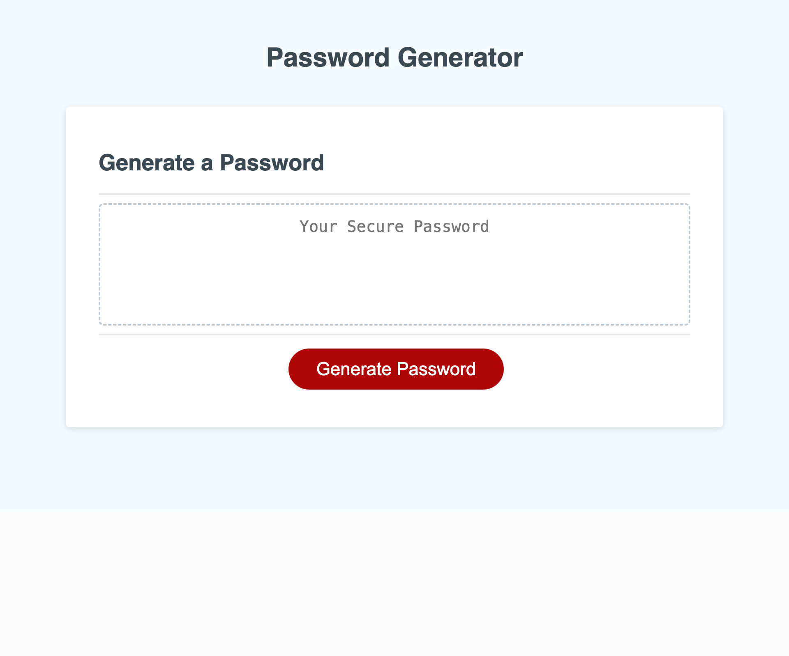

# Password-Generator Challenge

## Description

- The purpose of this challenge is to create a code using JavaScript to create a random password for the user. In order to create this code I had to first understand the few steps I needed to take to tackle the code. Initially daunting, I learned it is definitely a better approach and tackle each step one-by-one. I first had to understand that I would need to create arrays of different characters types the user is allowed to choose from. Secondly, I had to understand that I would have to make sure all the possible character type options were updated depending on each user's preference on which characters they wanted. In the end, after much debugging and much time trying to solidiify the basics of JavaScript, I was able to successfully complete the application!

## Installation

N/A

## Usage
- To use this application is fairly straight-forward. All that is needed to generate a new password is to click on red button with "Generate Password" on it and follow the given instructions and answer the questions needed to be able to generate a password for the user.

  GitHub page: https://noe-bee.github.io/password-generator/    
  GitHub repository: https://github.com/noe-bee/password-generator

 

## Credits
Special thanks to Sandrine for clarifying the logic of the project!

## License

Refer to the license on the repository.